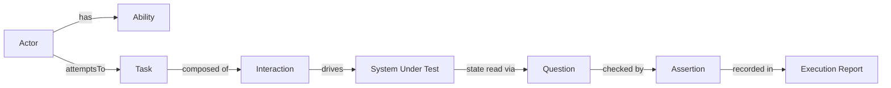

# StageCraft

StageCraft is a lightweight, extensible test automation framework built with TypeScript,
Playwright, and Serenity/JS, designed to demonstrate and validate the **Screenplay Pattern**
across UI and API testing.

## Purpose & Architecture

Most UI/API test suites end up as either a raw script soup or a Page Object Model that only
solves UI duplication, not shared concepts across UI and API. StageCraft demonstrates a third
option: the **Screenplay Pattern**, where a test scenario reads as a sequence of business
actions performed by an Actor, and the same conceptual model (Actor → Ability → Task →
Interaction → Question → Assertion) works identically whether the Actor is driving a browser or
calling a REST API.

StageCraft does not reimplement the Screenplay Pattern — it is built directly on top of
[Serenity/JS](https://serenity-js.org), which provides the `Actor`, `Ability`, `Task`,
`Interaction`, and `Question` primitives, plus `@serenity-js/playwright` (browser automation) and
`@serenity-js/rest` (HTTP API automation) bindings. StageCraft's own code is limited to the
business-specific Tasks and Questions for its two demonstration scenarios (a TodoMVC UI and the
JSONPlaceholder REST API) — see [`specs/001-screenplay-qe-framework/constitution.md`](specs/001-screenplay-qe-framework/constitution.md)
for the governing principles behind these decisions, in particular Principle I (Screenplay
Pattern First) and Principle X (Simplicity Before Abstraction).

## Screenplay Concepts

Each concept below maps to a single, dedicated folder under `src/` (see
[`data-model.md`](specs/001-screenplay-qe-framework/data-model.md) for the full contracts).

- **Actor** (`src/actors/`) — who performs a scenario, e.g. `"Alice"`. StageCraft relies on
  `@serenity-js/playwright-test`'s default actor cast, which automatically grants every actor
  `BrowseTheWebWithPlaywright` (bound to the test's `page`) and `CallAnApi` (bound to the
  project's `baseURL`) — no custom cast is needed for this framework's scope.
- **Ability** (`src/abilities/`) — what an Actor can do. `BrowseTheWebWithPlaywright` and
  `CallAnApi` both come from Serenity/JS itself; `src/abilities/index.ts` documents this rather
  than wrapping either Ability.
- **Task** (`src/tasks/`) — a business-oriented goal composed of Interactions and/or other Tasks,
  e.g. `OpenApplication()`, `AddItemToList('Buy milk')`, `GetPost(1)`, `CreatePost({...})`.
- **Interaction** — a single low-level operation, e.g. `Navigate.to(url)`, `Click.on(target)`,
  `Enter.theValue(text).into(target)`, `Send.a(GetRequest.to(path))`. StageCraft uses
  Serenity/JS's built-in Interactions directly (`src/interactions/` is documentation-only) rather
  than wrapping them.
- **Question** (`src/questions/`) — read-only state retrieved from the system under test, e.g.
  `ListItemNames()`, `ItemCompletionState('Walk the dog')`, or the built-in `LastResponse.body()`.
- **Assertion** — verifies an expected outcome via `Ensure.that(question, expectation)` from
  `@serenity-js/assertions`, e.g. `Ensure.that(ListItemNames(), containAtLeastOneItemThat(equals('Buy milk')))`.
- **Execution Report** — the structured record of a test run, produced by
  `@serenity-js/console-reporter` and `@serenity-js/html-reporter` — see [Reporting](#reporting)
  below.

## Project Structure

```text
src/
├── actors/            # Actor naming/config (relies on the default Playwright Test cast)
├── abilities/         # Documents that BrowseTheWebWithPlaywright/CallAnApi come from Serenity/JS
├── tasks/             # Business-oriented Tasks: OpenApplication, AddItemToList, GetPost, CreatePost
├── interactions/       # Documentation-only — no custom Interaction has been needed
├── questions/          # ListItemNames, ItemCompletionState
└── config/             # Environment-driven configuration (BASE_URL, API_BASE_URL, HEADLESS)

tests/
├── ui/                 # UI demonstration scenarios (TodoMVC, via Playwright)
└── api/                # API demonstration scenarios (JSONPlaceholder, via REST)

reports/
└── serenity-js/        # @serenity-js/html-reporter output (generated, not committed)

playwright.config.ts     # Serenity/JS + Playwright Test runner & reporter configuration
tsconfig.json            # Strict TypeScript configuration
package.json              # npm scripts: build, test:ui, test:api, test, report
.env.example              # Documented configurable values, no real secrets
```

## UI Example Walkthrough

[`tests/ui/add-item.spec.ts`](tests/ui/add-item.spec.ts):

```ts
import { containAtLeastOneItemThat, Ensure, equals } from '@serenity-js/assertions';
import { it } from '@serenity-js/playwright-test';

import { AddItemToList, OpenApplication } from '../../src/tasks';
import { ListItemNames } from '../../src/questions';

it('adds an item to the list', async ({ actor }) => {
    await actor.attemptsTo(
        OpenApplication(),                                                     // Task
        AddItemToList('Buy milk'),                                             // Task

        Ensure.that(ListItemNames(), containAtLeastOneItemThat(equals('Buy milk'))), // Question + Assertion
    );
});
```

Reading this top-to-bottom as plain English: **Alice** (the actor, injected by
`@serenity-js/playwright-test`'s `it` fixture) *opens the application*, *adds 'Buy milk' to the
list*, then the test *ensures* the list of item names contains 'Buy milk'. Nothing in the
scenario mentions CSS selectors, `page.locator(...)`, or keypresses — those live inside
`OpenApplication`, `AddItemToList`, and `ListItemNames` in `src/`.

## API Example Walkthrough

[`tests/api/get-post.spec.ts`](tests/api/get-post.spec.ts):

```ts
import { Ensure, equals } from '@serenity-js/assertions';
import { it } from '@serenity-js/playwright-test';
import { LastResponse } from '@serenity-js/rest';

import { GetPost } from '../../src/tasks';

interface Post { id: number; }

it('retrieves a post', async ({ actor }) => {
    await actor.attemptsTo(
        GetPost(1),                                            // Task → Send.a(GetRequest.to(...))

        Ensure.that(LastResponse.status(), equals(200)),        // Question + Assertion
        Ensure.that(LastResponse.body<Post>().id, equals(1)),   // Question + Assertion
    );
});
```

Same actor, same `attemptsTo(...)` shape, same `Ensure.that(question, expectation)` assertion
style as the UI scenario — only the Task (`GetPost`) and the underlying Ability (`CallAnApi`
instead of `BrowseTheWebWithPlaywright`) differ. This is the Technology-Agnostic Screenplay
Architecture principle in practice: the conceptual model does not change between channels.

## Data Flow



## Execution Commands

```bash
npm install                        # install dependencies
npx playwright install chromium    # install the Chromium browser used by the UI scenarios
npm run build                      # tsc --noEmit — strict type-check, no output
npm run test:ui                    # run only the UI (TodoMVC) scenarios
npm run test:api                   # run only the API (JSONPlaceholder) scenarios
npm test                           # run all scenarios (UI + API)
npm run report                     # serve the generated report and open it in a browser
```

`BASE_URL`, `API_BASE_URL`, and `HEADLESS` can be overridden via environment variables or a
`.env` file — see [`.env.example`](.env.example).

## Reporting

Every `npm test` / `npm run test:ui` / `npm run test:api` run produces two reports:

- **Console reporter** (`@serenity-js/console-reporter`) — immediate, human-readable
  Actor/Task/Interaction/Question/Assertion activity tree printed to the terminal as the run
  progresses.
- **HTML reporter** (`@serenity-js/html-reporter`) — a self-contained report written to
  `reports/serenity-js/`, viewable with `npm run report` (no manual post-processing step). For
  each scenario it shows the Actor name, the ordered activity tree, and the outcome
  (passed/failed). When a UI scenario fails, `Photographer.whoWill(TakePhotosOfFailures)`
  (configured in `playwright.config.ts`) attaches a screenshot taken at the point of failure,
  found under `reports/serenity-js/test-runs/<run-timestamp>/`.

## Scalability

Because Tasks and Questions are defined in terms of Abilities rather than concrete clients, a
new interaction channel — a database, a message queue, a second UI, a second API — is added by
introducing a new `Ability` (e.g., `QueryTheDatabase`) and a small set of channel-specific
Interactions/Questions, without changing the shape of `Actor`, `Task`, or `Question` themselves,
and without touching any existing scenario. For example, a future `CheckOrderWasPersisted`
Question could read from a database Ability the same way `ListItemNames` reads from
`BrowseTheWebWithPlaywright` today — the scenario-level `actor.attemptsTo(...)` style stays
identical. This is Constitution Principle XI (Scalable Architecture) in practice.
